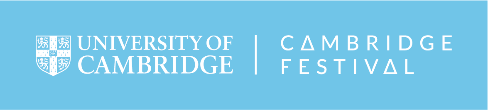

> Hello! 
> We are scientists from the [Department of Obs & Gynae](https://www.obgyn.cam.ac.uk/), [University of Cambridge](https://www.cam.ac.uk/) and we run an online event for [the Cambridge Festival 2021](https://www.sciencefestival.cam.ac.uk/). 

> At the Department of Obstetrics and Gynaecology, we do research on the biology and the function of the placenta. We also conduct large population studies which aim at identifying key features that could predict problems in pregnancy. Our ultimate goal is to find better ways of helping mums to give birth to healthy babies.

# Event1: It takes three to tango
***
> Learn about the key players in a healthy pregnancy (mum, baby and the placenta), bust some myths and test your knowledge through our [interactive info-quizzes](it-takes-three-to-tango.html).

   

# Event2: Pregnancy - a nine month phone call
***
> [Have a go](nine-month-phone-call.html) at colouring these pages while you learn more about the placenta and how it connects the mum and baby through our video and colouring papers. The activity is suitable for younger children who already know where babies come from, but doesn’t require any detailed biological knowledge.)

   

# We would love to hear from you
***
> Please give us some [feedback](https://www.surveymonkey.co.uk/r/HZDJ778) for us to improve bettter next time.

  

# Useful links 
***
* [Source code](https://github.com/ObsGynaeCam/CF2021) - this event is an open source project.
* [Previous event](https://sung.github.io/CamObsGynCSF2020/) - Science Festival 2020 from us.
   

# Acknowledgement
***
* This project was initially funded by [Public Engagment Starter Fund in 2019](https://www.cam.ac.uk/public-engagement/information-for-staff-and-students/public-engagement-starter-fund-0), University of Cambridge
   

<!---->
