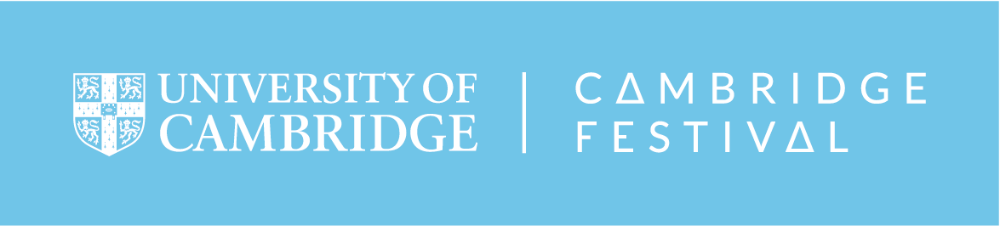

> Learn about the key players in a healthy pregnancy (mum, baby and the placenta), bust some myths and test your knowledge through our interactive info-quizzes.

# Description
***

>Learn about the key players in a healthy pregnancy: the mum, the baby and the placenta. Discuss the latest research at the [Department of Obstetrics & Gynaecology](https://www.obgyn.cam.ac.uk/) and understand the role of the placenta through interactive hands-on activities.

>[Placenta](https://en.wikipedia.org/wiki/Placenta) is a very important organ, yet often overlooked. At our interactive display you can learn how the placenta looks like and what jobs it performs. Kids and parents can have a go at a placenta maze game or model the placenta out of play dough. You will also have an opportunity to learn interactively about healthy diet and lifestyle during pregnancy and about antenatal care and the baby’s development. We will demonstrate the assessment of fetal growth using various methods and you will have a chance to examine ultrasound images of babies.

>At the [Department of Obstetrics and Gynaecology](https://www.obgyn.cam.ac.uk/), we do research on the biology and the function of the placenta. We also conduct large population studies which aim at identifying key features that could predict problems in pregnancy. Our ultimate goal is to find better ways of helping mums to give birth to healthy babies.

  

# On-line presentations and quizzes
***
* Mum - coming soon
* [Baby](slide-and-quiz/baby.html){target="_blank"}
* [Placenta](slide-and-quiz/placenta.html){target="_blank"}
   

# We would love to hear from you
***
> Please give us some [feedback](https://www.surveymonkey.co.uk/r/HZDJ778) for us to improve bettter next time.

  

# Useful links 
***
* [Source code](https://github.com/ObsGynaeCam/CF2021) - this event is an open source project.
* [Previous event](https://sung.github.io/CamObsGynCSF2020/) - Science Festival 2020 from us.
   

# Acknowledgement
***
* This project was initially funded by [Public Engagment Starter Fund in 2019](https://www.cam.ac.uk/public-engagement/information-for-staff-and-students/public-engagement-starter-fund-0), University of Cambridge
   

<!---->
