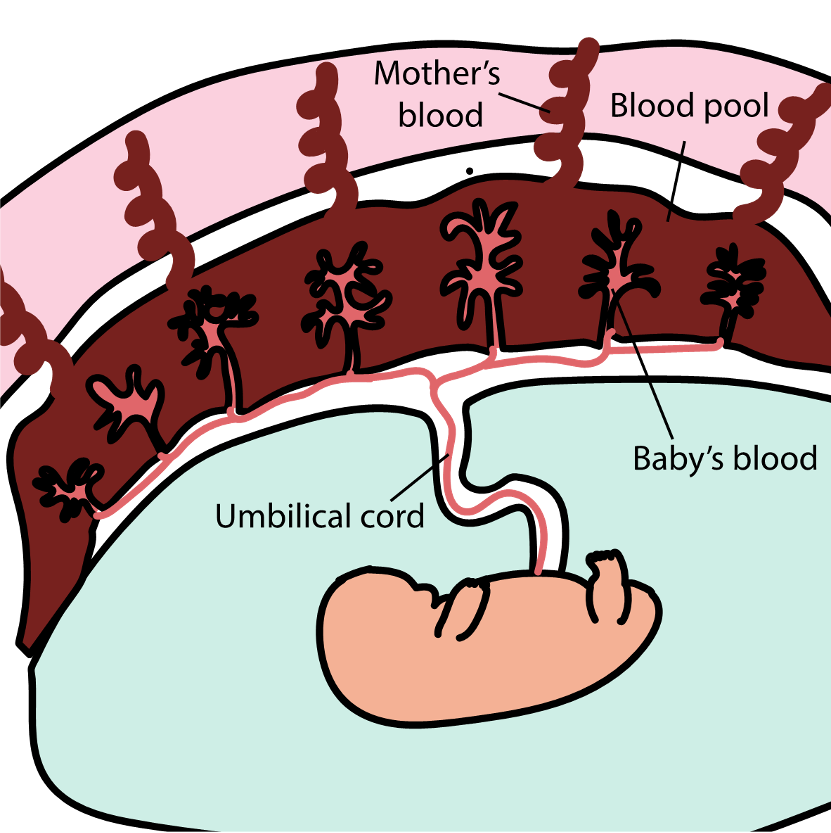
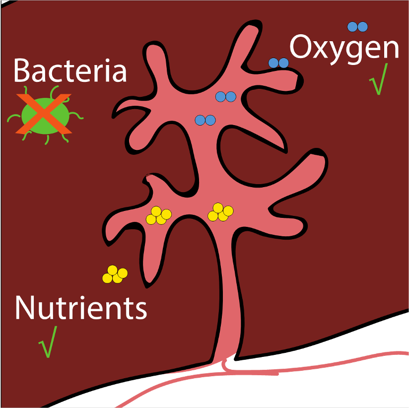
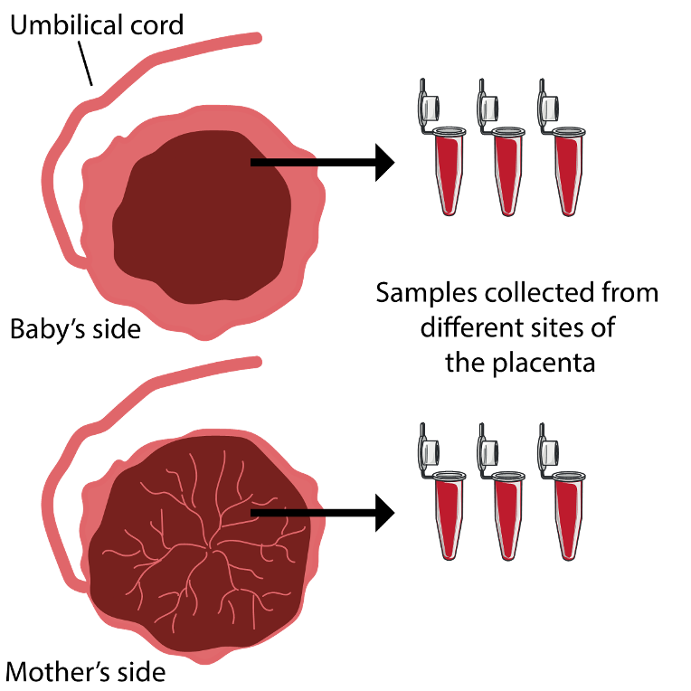

```{r setup, include=FALSE, message=FALSE, warning=FALSE}
library(knitr)
knitr::opts_chunk$set(cache=TRUE, echo = FALSE, message=FALSE, warning=FALSE) # set global options
```

# What is the placenta?
- An organ attached to the lining of the womb
- The vital link between the mum and the baby during pregnancy

# What does it do?
- Transfers oxygen and nutrients to the growing baby via the umbilical cord
- Removes carbon dioxide and waste products from the baby’s blood
- Shields the baby against most infections
- Produces hormones which support the pregnancy

# How to keep it healthy?
- Attend antenatal check-ups regularly
- Avoid smoking, drinking alcohol and using illegal drugs during pregnancy
- Consult your doctor before taking any medicines or supplements during pregnancy

# First trimester (1-12 weeks)
- The placenta is formed
- Some cells from the embryo will form the baby’s side of the placenta, by attaching to the wall of the uterus
- The umbilical cord is formed. It provides a connection between the baby and the placenta
- On the mother’s side, there is an increased blood flow to certain “blood pools”

## First trimester (continued)
- The baby’s and mother’s blood will actually never mix. They will be separated via blood vessel walls in these “blood pools”
- The vessel wall will, however, allow small substances, like oxygen and sugar, to pass between the mother to the baby
- At end of the first trimester, the baby gets a full blood supply from the placenta

## 

# Second trimester (13-27 weeks)
- The baby will now receive essential substances, such as oxygen and nutrition, via the placenta and the umbilical cord
- Larger substances, like most bacteria, cannot pass from the mother to the baby, which means that the baby is protected from most pathogens even if the mother gets infected
- Waste products from the baby are transported via the placenta to the mother, and are then processed further in the mother’s organs

## 

# Third trimester (28-40+ weeks)
- Immunoglobulin G antibodies can pass from the mother to the baby. These antibodies can help the baby’s immune system to recognise and destroy pathogens
- At end of pregnancy, the placenta weighs around 500 g (or 1lb)

# Delivery
- The placenta detaches from the uterus and is delivered after the baby is born
- The placenta is usually disposed afterwards. However, sometimes placentas are collected for research purposes
- The examination of the placenta can help researchers to better understand placental function and the role the placenta plays in a healthy pregnancy, and to develop new tests and therapies to prevent any placenta-related problems in pregnancy

## 

# References
> - [NHS](https://www.nhs.uk/common-health-questions/pregnancy/what-is-the-placenta/)
> - [Cambridge University](https://www.cam.ac.uk/research/news/understanding-the-placenta-the-key-to-healthy-life)
> - [BBC](https://www.bbc.co.uk/bitesize/guides/z9fgr82/revision/5)

# Quiz
<iframe src="placenta_quiz.html" title="placenta quiz" style="top:0; left:0; bottom:0; right:0; width:100%; height:600px; border:none; margin:0; padding:0; overflow:hidden; z-index:999999;">Your browser doesn't support iframes.<br>Try <a href="https://obsgynaecam.github.io/CF2021/slide-and-quiz/placenta_quiz.html"</iframe>

# Thank you for visiting us
> - Please give us some <u>[feedback through a short survey](https://www.surveymonkey.co.uk/r/HZDJ778)</u>. This will help us to develop our event further.
> - Please see <u>[this](https://github.com/ObsGynaeCam/CF2021/)</u> if you'd like to know how it was made. 
